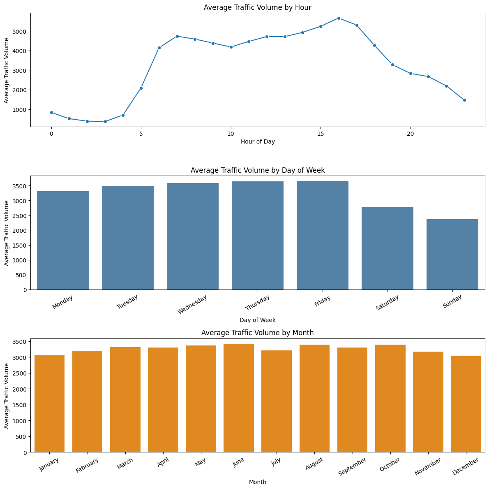
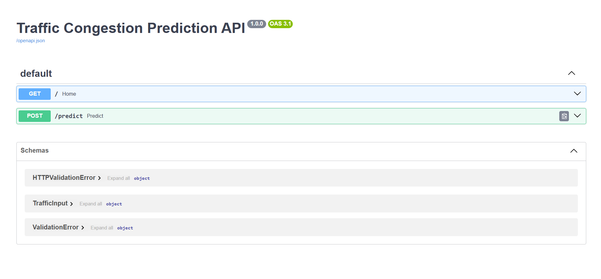
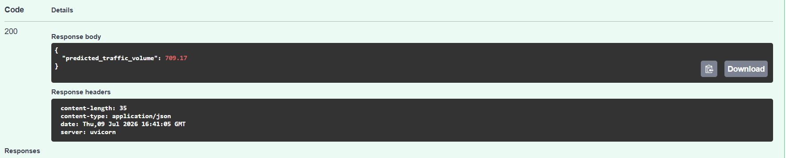
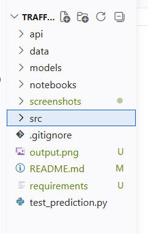

# 🚦 AI-Powered Traffic Congestion Prediction System

A Machine Learning project that predicts traffic congestion using weather conditions and time-based features. The project includes data preprocessing, exploratory data analysis (EDA), model training with Random Forest, and a FastAPI-based prediction API.

---

## 🚀 Features

- Exploratory Data Analysis (EDA)
- Feature Engineering
- Random Forest Regression Model
- FastAPI REST API
- Interactive Swagger Documentation
- Predict Traffic Volume from User Inputs

---

## 🛠️ Tech Stack

- Python
- Pandas
- NumPy
- Scikit-learn
- FastAPI
- Uvicorn
- Joblib
- Matplotlib
- Jupyter Notebook

---

## 📂 Project Structure

```
traffic_congestion_prediction/
│
├── api/
├── data/
├── models/
├── notebooks/
├── screenshots/
├── src/
├── test_prediction.py
├── requirements.txt
├── README.md
```

---

## 📊 Screenshots

### Exploratory Data Analysis



---

### API Documentation (Swagger UI)



---

### Prediction Result



---

### Project Structure



---

## 📈 Model Performance

| Model | MAE | RMSE | R² Score |
|------|------:|------:|------:|
| Linear Regression | 611.66 | 3330.97 | -1.7753 |
| Decision Tree | 600.10 | 1023.09 | 0.7382 |
| Random Forest | **261.49** | **462.45** | **0.9465** |
| Tuned Random Forest | 352.16 | 554.19 | 0.9232 |

---

## ▶️ Run the Project

Install dependencies

```bash
pip install -r requirements.txt
```

Run the API

```bash
uvicorn api.main:app --reload
```

Open Swagger Documentation

```
http://127.0.0.1:8000/docs
```

---

## 👩‍💻 Author

**Vinutha Shanabhogara**

GitHub: https://github.com/Vinutha017